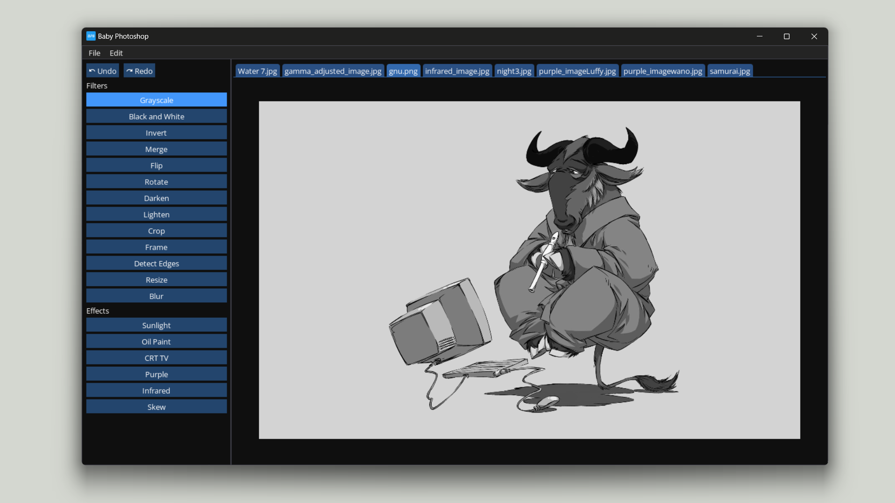

# Ayin



## Features

- [x] Multiple image tabs
- [x] Undo, and redo stack
- [x] Follow device theme (Works on Win32)

## Build on Windows/MinGW-w64

1. Install [MSYS2](https://www.msys2.org/)
2. Open `MSYS2 UCRT64`
3. Install dependencies:
```
$ pacman -S --needed base-devel mingw-w64-ucrt-x86_64-toolchain mingw-w64-ucrt-x86_64-SDL2 mingw-w64-ucrt-x86_64-freetype
```
5. Build
```
$ cd /path/to/ayin/
$ make mode=release
$ ./target/release/ayin.exe
```

### Configure MSYS2 UCRT64 for VSCode

1. Ctrl+Shift+P
2. Preferences: Open User Settings (JSON)
3. Copy this inside of your `settings.json`
```json
    "terminal.integrated.profiles.windows": {
        "MSYS2 UCRT": {
            "path": "cmd.exe",
            "args": [
                "/c",
                "C:/msys64/msys2_shell.cmd -defterm -here -no-start -ucrt64"
            ]
        }
    }
```
